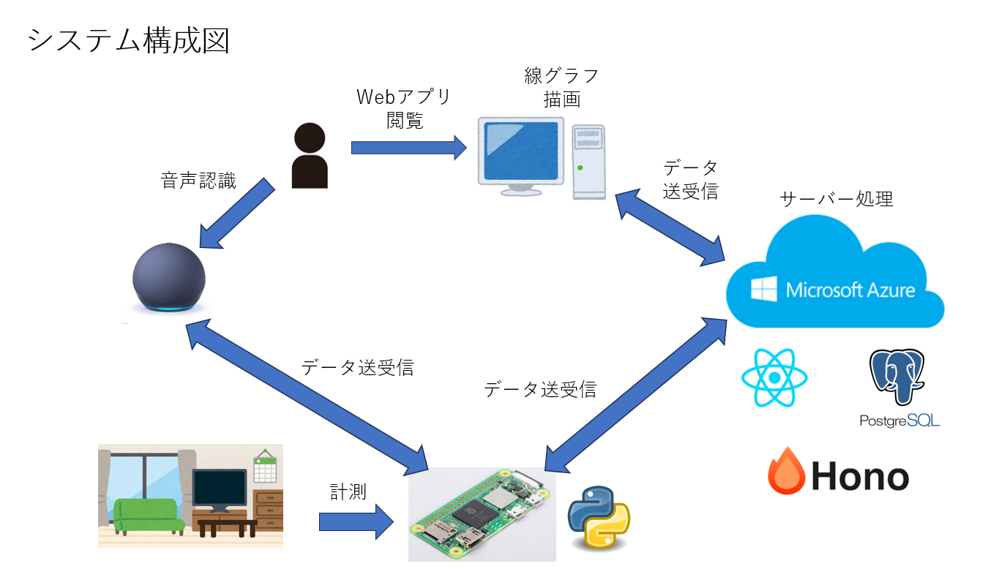

# 制作テーマ
- 室内環境計測・通知システム
- 参考サイト：https://crexgroup.com/ja/development/development/raspberry-pi-project-ideas/
## 具体的な機能
- リビング内の室温、湿度、気圧を計測し、Webアプリ上にて確認できる機能
- 一時間ごとに、上記の各値を計測し、サーバーに記録を送信、DBに登録する機能
- 特定の気温や湿度などの閾値を超えると、スマートスピーカーで知らせる機能
- Webアプリでの画面上にて、各計測値をグラフで表示する機能
- スマートスピーカーを作成し、「現在の室温は？」と聞くと、その情報を返す機能
- 通常のスマートスピーカーとしても機能させる
## 使用機材
- Raspberry Pi Zero 2 W
- USBスピーカー(Type-A)
- 温度・湿度・気圧センサー(RaspberryPiで、GPIOピンに接続) 
## 使用技術
- `React`(Webアプリ、フロントエンド用、MUIを使用してみる、レスポンシブデザインは不要)
  - 線グラフの描画は、`chart.js`を使用
- `Hono`(Webアプリ、バックエンド用)
  - ORMとして、`Prisma`を使用
- `PostgreSQL`（Webアプリ、DB用）
- `Python`（RaspberryPiシステム用）
- `Alexa Voice Service`, Google Assistant SDK（音声認識）
- AWS, `MS Azure`(クラウド上でのサーバー、DB)
## 開発フェーズ
1. ~~設計書作成(画面仕様書、API設計書、E-R図)~~
2. ~~開発環境の整備（必要な技術のインストール、GitHubでのリポジトリ作成）~~
3. Webアプリの作成（バックエンド）
  - DB作成
  - DBからの取得APIの作成
  - DBへの登録APIの作成
4. Webアプリの作成（フロントエンド、デザインは簡素でOK）
  - フロントエンドの作成
  - バックエンドとの結合 
5. RaspberryPiでの環境センサーの作成
6. Webアプリと環境センサーの結合
7. スマートスピーカーの作成
8. Webアプリ、RaspberryPi、スマートスピーカーの結合
9.  クラウド環境の作成 (1~6まではローカルサーバーで作成)
10. Webアプリ、RaspberryPi、スマートスピーカー、クラウド環境の結合
11. 結合テスト
12. システムテスト
## システム構成図

## 画面の種類
- 室温グラフを表示する画面（ホーム画面）
  - センサー通知の閾値を設定する機能
  - 1h, 1day, 1week, 1monthごとの表示機に切り替えることが可能
    - 1h以外は、計測した値の平均値を算出、表示
- 湿度グラフを表示する画面
  - センサー通知の閾値を設定する機能
  - 1h, 1day, 1week, 1monthごとの表示機に切り替えることが可能
    - 1h以外は、計測した値の平均値を算出、表示
- 気圧グラフを表示する画面
  - センサー通知の閾値を設定する機能
  - 1h, 1day, 1week, 1monthごとの表示機に切り替えることが可能
    - 1h以外は、計測した値の平均値を算出、表示
- 外気温情報を取得・表示する画面
  - OpenWeatherAPIを使用
  - 1h, 1day, 1week, 1monthごとの表示機に切り替えることが可能
    - 1h以外は、計測した値の平均値を算出、表示
## APIの種類
- 室内温度取得API
- 室内温度登録API
- 室内湿度取得API
- 室内湿度登録API
- 室内気圧取得API
- 室内気圧登録API
- 室外気温取得API
- 室外気温登録API
- 室外湿度取得API
- 室外湿度登録API
- 室外気圧取得API
- 室外気圧登録API
## データの種類
### 室内計測情報管理テーブル
- 計測ID(Int)
- 室内温度(Float)
- 室内湿度(Float)
- 室内気圧(Float)
- 計測時間(Date)
- 計測場所(String)
### 室外計測情報管理テーブル
- 計測ID(Int)
- 室外気温(Float)
- 室外湿度(Float)
- 室外気圧(Float)
- 計測時間(Date)
### 閾値管理テーブル
- 設定ID(Int)
- 室内温度最高閾値(Float)
- 室内温度最低閾値(Float)
- 室内湿度最高閾値(Float)
- 室内湿度最低閾値(Float)
- 室内気圧最高閾値(Float)
- 室内気圧最低閾値(Float)