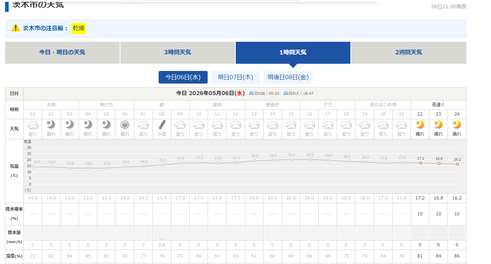

# 制作テーマ
- 室内環境計測・通知システム
- 参考サイト：https://crexgroup.com/ja/development/development/raspberry-pi-project-ideas/
## ToDo
- フロントエンド画面上でのグラフの描画
  - 「日」、「週」、「月」のページを作成する
  - 「日」のグラフの作成
## 画面仕様
- 日：1日を1時間単位で区切ったときの、温度推移グラフ(00:00)
  - 時刻表示部分は
- 週：1週を1日単位で区切ったときの、温度推移グラフ（折れ線グラフで、室内外の最高・最低温度を表示する）
- 月：30, 31日間の各日のデータを表形式で表示（室内外の最高・最低温度を表示する）
- タブで上記3種の切り替えを実現する
  - ページ遷移時のタイミングで「日」を表示したい＆切り替えをしたいため
- DBの温度のデータをすべての期間で一括で取得する
- 時間軸別のタブの切り替えの際に、バックエンドからのロードを挟まないようにし、表示のみを切り替えるようにする
- バックエンド側から室内環境データ（温度、測定時刻）を取得する
- バックエンド側から室外環境データ（温度、測定時刻）を取得する
- 各測定時刻を、「00:00」のような形の表記に変更する
- グラフに時刻と温度の情報を、青色でプロットする（室内）
- グラフに時刻と温度の情報を、灰色でプロットする（室外）
## 具体的な機能
- リビング内の室温、湿度、気圧を計測し、Webアプリ上にて確認できる機能
- 一時間ごとに、上記の各値を計測し、サーバーに記録を送信、DBに登録する機能
- 特定の気温や湿度などの閾値を超えると、スマートスピーカーで知らせる機能
- Webアプリでの画面上にて、各計測値をグラフで表示する機能
  - 室内と室外の情報を切り替えて、同時または片方を表示できるようにする
- スマートスピーカーを作成し、「現在の室温は？」と聞くと、その情報を返す機能
- 通常のスマートスピーカーとしても機能させる
## 使用機材
- Raspberry Pi Zero 2 W
- USBスピーカー(Type-A)
- 温度・湿度・気圧センサー(RaspberryPiで、GPIOピンに接続) 
## 使用技術
- `React`(Webアプリ、フロントエンド用、MUIを使用してみる、レスポンシブデザインは不要)
  - 線グラフの描画は、`chart.js`を使用
- `Hono`(Webアプリ、バックエンド用)
  - ORMとして、`Prisma`を使用
- `PostgreSQL`（Webアプリ、DB用）
- `Python`（RaspberryPiシステム用）
- `Alexa Voice Service`, Google Assistant SDK（音声認識）
- AWS, `MS Azure`(クラウド上でのサーバー、DB)
## 開発フェーズ
1. ~~設計書作成(画面仕様書、API設計書、E-R図)~~
2. ~~開発環境の整備（必要な技術のインストール、GitHubでのリポジトリ作成）~~
3. Webアプリの作成（バックエンド）
  - DB作成
  - DBからの取得APIの作成
  - DBへの登録APIの作成
4. Webアプリの作成（フロントエンド、デザインは簡素でOK）
  - フロントエンドの作成
  - バックエンドとの結合 
    - https://kou029w.github.io/intro-to-web-dev/hono-react/hands-on.html
5. RaspberryPiでの環境センサーの作成
6. Webアプリと環境センサーの結合
7. スマートスピーカーの作成
8. Webアプリ、RaspberryPi、スマートスピーカーの結合
9.  クラウド環境の作成 (1~6まではローカルサーバーで作成)
10. Webアプリ、RaspberryPi、スマートスピーカー、クラウド環境の結合
11. 結合テスト
12. システムテスト
## システム構成図

## 画面の種類
- 室温グラフを表示する画面（ホーム画面）
  - センサー通知の閾値を設定する機能
  - 1h, 1day, 1week, 1monthごとの表示機に切り替えることが可能
    - 1h以外は、計測した値の平均値を算出、表示
  - 
    - 横軸：時間（1hごと）
    - 縦軸：温度（5℃ごと）
- 湿度グラフを表示する画面
  - センサー通知の閾値を設定する機能
  - 1h, 1day, 1week, 1monthごとの表示機に切り替えることが可能
  - 各計測時間を基に、chart.jsにて適宜グラフを作成する
- 気圧グラフを表示する画面
  - センサー通知の閾値を設定する機能
  - 1h, 1day, 1week, 1monthごとの表示機に切り替えることが可能
    - 1h以外は、計測した値の平均値を算出、表示
- 外気温情報を取得・表示する画面
  - OpenWeatherAPIを使用
  - 1h, 1day, 1week, 1monthごとの表示機に切り替えることが可能
    - 1h以外は、計測した値の平均値を算出、表示
    - node-cronを使用して、毎時0分の処理を実行
      - https://codingls.com/nodejs/4599/
- 閾値到達通知
  - discord webhookを使用
## APIの種類
### 室内環境系
- 室内温度取得API
- 室内湿度取得API
- 室内気圧取得API
- 室内環境測定値登録API
### 室外環境系
- 室外気温取得API
- 室外気温登録API
- 室外湿度取得API
- 室外湿度登録API
- 室外気圧取得API
- 室外気圧登録API
### 測定閾値系
- 閾値取得API
- 閾値登録API
## データの種類
### 室内計測情報管理テーブル
- 計測ID(Int)
- 室内温度(Float)
- 室内湿度(Float)
- 室内気圧(Float)
- 計測時間(Date)
- 計測場所(String)
### 室外計測情報管理テーブル
- 計測ID(Int)
- 室外気温(Float)
- 室外湿度(Float)
- 室外気圧(Float)
- 計測時間(Date)
### 閾値管理テーブル
- 設定ID(Int)
- 室内温度最高閾値(Float)
- 室内温度最低閾値(Float)
- 室内湿度最高閾値(Float)
- 室内湿度最低閾値(Float)
- 室内気圧最高閾値(Float)
- 室内気圧最低閾値(Float)
## URLパス一覧
[室内環境]
### 室内温度取得
- measurement/temperature/get : OK
### 室内湿度取得
- measurement/humidity/get : OK
### 室内気圧取得
- measurement/air-pressure/get : OK
### 室内環境情報登録
- measurement/inside/post : OK
[室外環境]
### 室外温度取得
- measurement/temperature/get/outside : OK
### 室外湿度取得
- measurement/humidity/get/outside : OK
### 室外気圧取得
- measurement/air-pressure/get/outside : OK
### 室外環境情報登録
- measurement/outside/post : OK
[閾値]
### 閾値登録画面
- measurement/threshold/get : OK
- measurement/threshold/put : OK