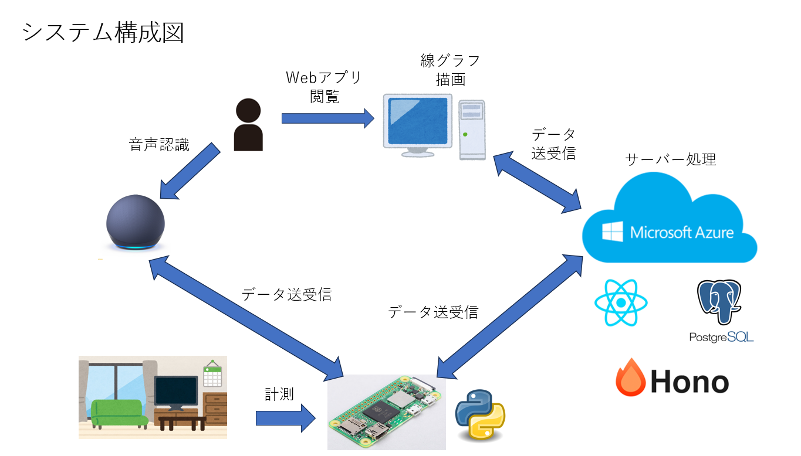

# 制作テーマ
- 室内環境計測・通知システム
- 参考サイト：https://crexgroup.com/ja/development/development/raspberry-pi-project-ideas/
## 機能要件
### クライアント側
- リアルタイム環境確認機能
  - 現在の室外・内の環境情報（温度、湿度、気圧）
- 時間単位履歴確認機能
  - 1時間単位での環境情報を折れ線グラフで確認できる機能
  - 1週間前までの情報を参照可能
- 日単位履歴確認機能
  - 1日単位での環境情報を表形式で確認できる機能
  - 6カ月前までの情報を参照可能
- 通知機能
  - 測定した環境情報が閾値を超えたときに、Webアプリ上に通知する機能
  - ヘルスチェックがエラーの際は通知を行う
- 通知設定機能
  - エッジ端末の閾値を設定する機能
  - デフォルトで値を設定しておく
### サーバー側
- 環境情報受信機能
  - エッジ端末から送信される環境情報を受け取る機能
- 閾値判定機能
  - 環境情報が閾値を超えているかを判定する機能
- 閾値設定送信機能
  - クライアント側での通知設定機能によって設定した閾値を、エッジ端末に送信する機能
- 履歴保存機能
  - 受信した環境情報を保存する機能
- ヘルスチェック受信機能
  - 60秒毎にエッジ端末との持続的な通信を確認する機能
### エッジ端末側
- 閾値設定受信機能
  - サーバーから閾値設定情報を受け取り、エッジ端末上に反映させる機能
- 環境情報測定機能
  - 環境情報を測定する機能
- ヘルスチェック送信機能
  - 60秒毎に、サーバーに対して簡易的な情報を送信する機能
### 将来的に追加したい機能
- 閾値を超えると、スマートスピーカーで知らせる機能
- Discord上で通知する機能
## 非機能要件
- クラウドを使用する際は、月の料金を1000円以内に収めるようにする
- ログの保持期間は6カ月とする
## 使用機材
- Raspberry Pi Zero 2 W
- 温度・湿度・気圧センサー(RaspberryPiで、GPIOピンに接続) 
## 使用技術
- `React`(Webアプリ、フロントエンド用、MUIを使用してみる、レスポンシブデザインは不要)
  - 線グラフの描画は、`chart.js`を使用
- `Hono`(Webアプリ、バックエンド用)
  - ORMとして、`Prisma`を使用
- `PostgreSQL`（Webアプリ、DB用）
- `Python`（RaspberryPiシステム用）
- `Alexa Voice Service`, Google Assistant SDK（音声認識）
- AWS, `MS Azure`(クラウド上でのサーバー、DB)
## 開発フェーズ
1. 設計書作成(画面仕様書、API設計書、E-R図)
2. 開発環境の整備（必要な技術のインストール、GitHubでのリポジトリ作成）
3. Webアプリの作成（バックエンド）
4. Webアプリの作成（フロントエンド）
5. エッジ端末プログラムの作成（電子工作を含む）
6. Webアプリとエッジ端末の結合
7. クラウド環境の作成 (1~6まではローカルサーバーで作成)
8. Webアプリ、RaspberryPi、クラウド環境の結合
9. 結合テスト
10. システムテスト
## システム構成図

